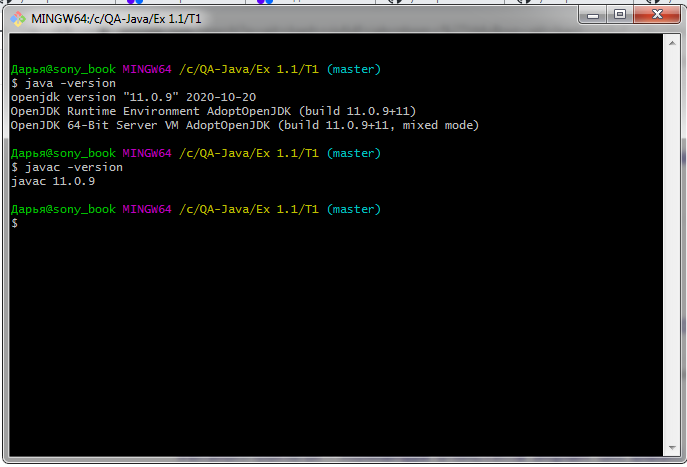

# Отчёт о тестировании инструкции по установке OpenJDK11 на Windows

## Краткое описание

24.10.20 было проведено Installation testing приложения **OpenJDK11**.

На тестирование затрачено: 1 ч.

В результате тестирования дефекты не выявлены.

Ожидаемый результат совпадает с фактическим:
* Программа установлена

---
## Описание процесса тестирования

В процессе тестирования использовались следующие артефакты:
* [Инструкция по установке OpenJDK11](https://github.com/netology-code/javaqa-homeworks/blob/master/intro/openjdk11-manual.md)

---
#### Тестирование производилось в следующем окружении:
* OS: Windows 7 Professional, Service pack 1, 64-bit
* Java version: OpenJDK 11.0.9

---
#### Вложения
