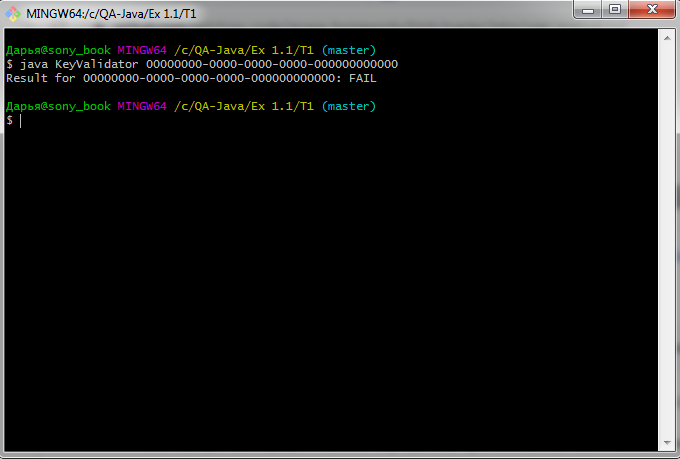

# Отчёт о тестировании запуска и совместимости приложения KeyValidator с Java 11

## Краткое описание

24.10.20 было проведено Smoke testing приложения **KeyValidator**.

На тестирование затрачено: 1 ч.

В результате тестирования дефекты не выявлены.

Ожидаемый результат совпадает с фактическим:
* Программа запускается
* Программа совместима с Java 11

---
## Описание процесса тестирования

В процессе тестирования использовались следующие артефакты:
* [Руководство использования **KeyValidator**](https://github.com/netology-code/javaqa-homeworks/blob/master/intro/user-manual.md)

---
#### Тестирование производилось в следующем окружении:
* OS: Windows 7 Professional, Service pack 1, 64-bit
* Java version: OpenJDK 11.0.9

---
#### Вложения
